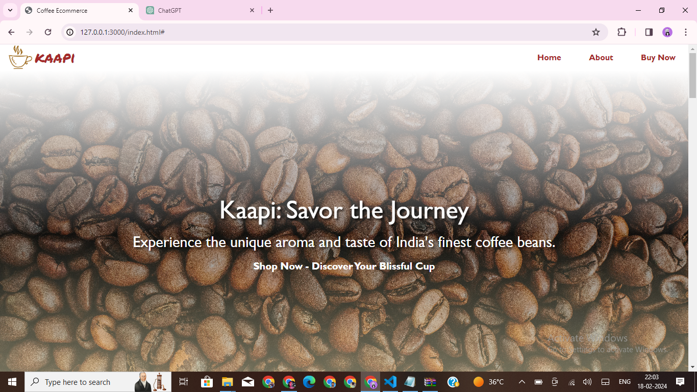
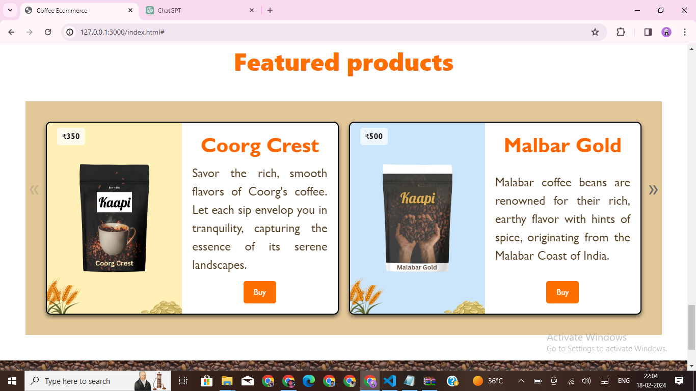
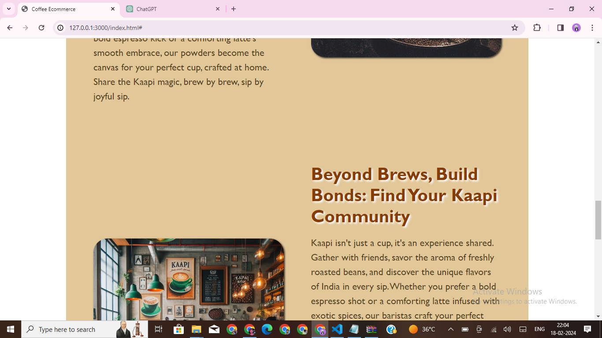
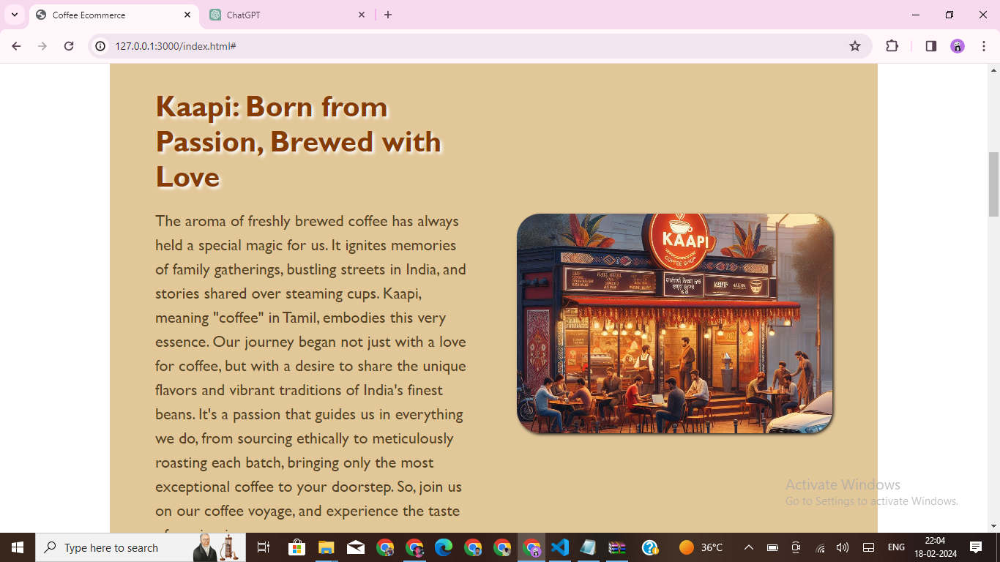

# Welcome to My Coffee Ecommerce Website -Kaapi🌟

## About
This repository contains the source code for my coffee ecommerce website, where users can explore and purchase various coffee products. It's a project born out of passion for coffee and aims to provide a delightful shopping experience to coffee enthusiasts.

## Features
🛒 **Easy Shopping**: Browse through our collection of premium coffee products and purchase your favorites with just a few clicks.
🌟 **Featured Products**: Discover our curated selection of featured products, carefully chosen to provide the best coffee experience.
🎨 **Beautiful Design**: Enjoy a visually appealing and user-friendly design that enhances your shopping experience.
📱 **Responsive**: Access the website seamlessly across various devices, including desktops, tablets, and smartphones.
🔧 **Customizable**: The codebase is highly customizable, allowing you to tailor the website to your specific requirements or preferences.

## Technologies Used
- HTML5
- CSS3
- JavaScript
- Bootstrap 5
- Glider.js

## How to Use
1. Clone this repository to your local machine.
2. Open the `index.html` file in your web browser to view the website locally.
3. Explore the website, shop for your favorite coffee products, and enjoy!

## Screenshots

## Contributions
Contributions are welcome! If you have any ideas for improvements or new features, feel free to open an issue or submit a pull request.

## Credits
- Images: [Unsplash](https://unsplash.com/)
- Fonts: [Google Fonts](https://fonts.google.com/)
- Icons: [Font Awesome](https://fontawesome.com/)

## Contact
If you have any questions, feedback, or just want to say hello, you can reach out to me at [shantan125@example.com](mailto:shantan125@example.com).

---

Thank you for visiting! ☕️✨
